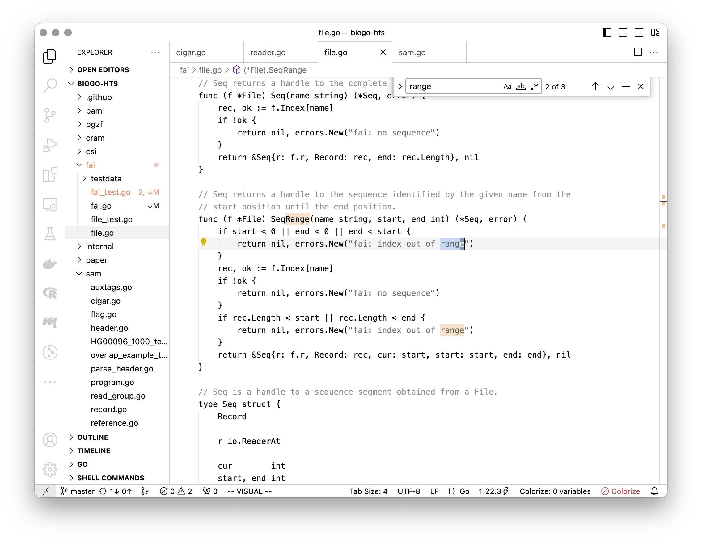

# Λόγος

Themes with minimal monochrome syntax highlighting and calm UI.

## About

I find most multicolored syntax and UI themes to be garish and overwhelming to look at for extended periods of time..

These themes use a few shades of a primary "base" color to highlight comments and strings.

Overall, an attempt is made to balance simplicity with usability.

## Theme variants

| variant | type  | description                   |
| ------- | ----- | ----------------------------- |
| white   | light | neutral theme                 |
| sun     | light | off-white theme               |
| acme    | light | yellow theme                  |
| dark    | dark  | neutral theme                 |
| gruv    | dark  | warm dark theme               |
| nord    | dark  | cool dark theme               |

## Screenshots

Here is a screenshot of some Go code using the `Logos White` theme.

Auto-generated examples can be viewed at [vscodethemes.com](https://vscodethemes.com/e/brendes.logos-themes/logos-white).
The website renders the themes a little inaccurately, but it will do for now.

## Install
- In VS Code: `⌘-P` then `ext install logos-themes`
- On the web: https://marketplace.visualstudio.com/items?itemName=brendes.logos-themes

## Build

Requires vsce and Python ≥ 3.11.
- Build themes: `make build`
- Build extension: `make package`

## Credits/inspiration
- [Acme editor](https://en.wikipedia.org/wiki/Acme_%28text_editor%29)
- [Gruvbox](https://github.com/morhetz/gruvbox)
- [Nord](https://www.nordtheme.com)