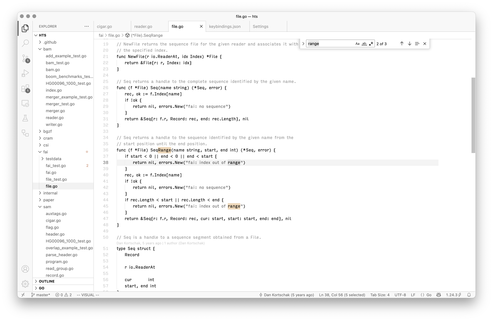
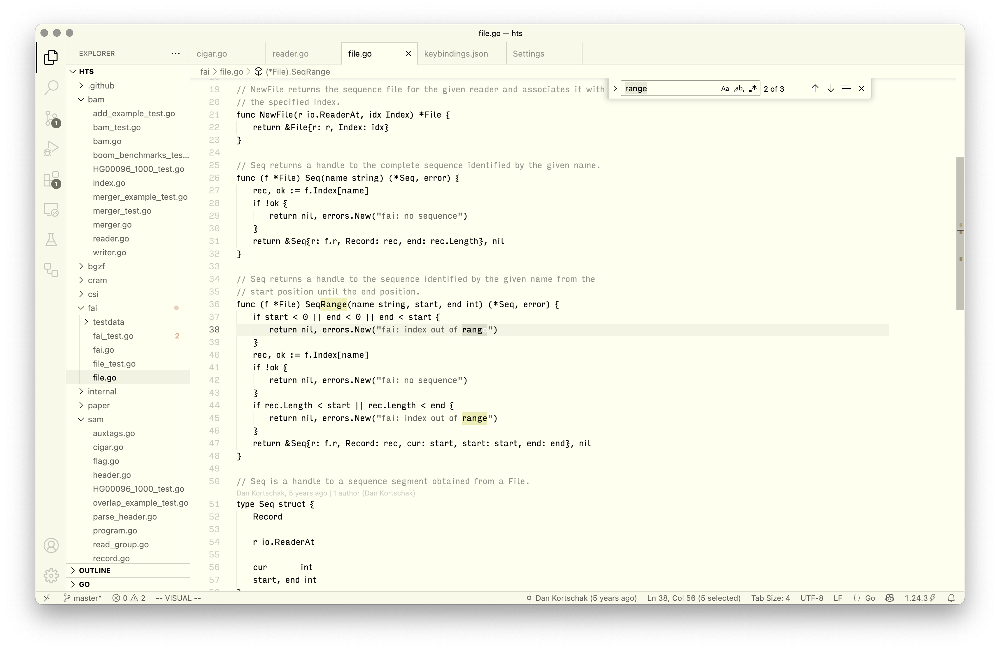
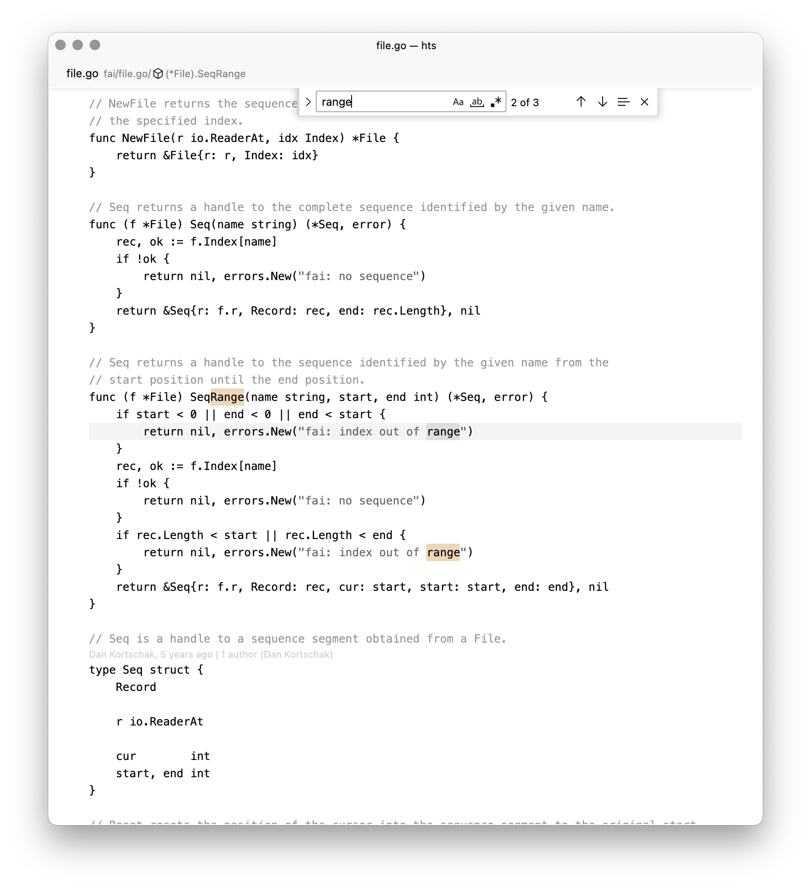
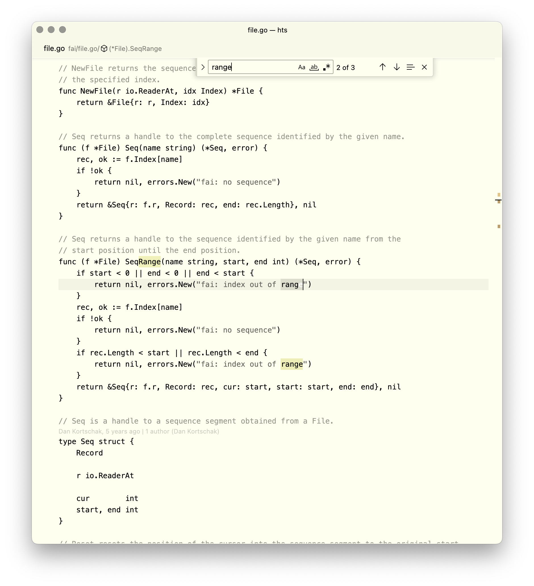

# Λόγος

Minimal themes with monochrome syntax highlighting and calm UI

## Why

Multicolored syntax themes tend to be garish and disharmonious.
UI themes tend to somehow achieve being overly busy while making it difficult to visually identify boundaries.
Together, it's all very overwhelming and unpleasant to look at and use for any extended period of time.

These themes use a few shades of a primary base color to highlight comments and a few other text elements.
A handful of accent colors are used for other UI elements where the monochrome scheme would fall short.
Overall, an attempt is made to balance simplicity with usability.

## Variants

| theme | type | base |
|------|------|------|
| logos | light | #ffffff |
| sun | light | #fffffa |
| acme | light | #ffffea |
| paper | light | #faf7f2 |
| blue | dark | #3b4870 |
| gruv | dark | #302d2c |
| dark | dark | #282828 |

## Screenshots
TODO: outdated

Some Go code using the `Logos` and `Logos Acme` themes.




<!-- 
 -->

Same as above, with a minimal UI configuration.




<!-- 
 -->


Auto-generated examples can be viewed at [vscodethemes.com](https://vscodethemes.com/e/brendes.logos-themes/logos-white).
The website renders the themes a little inaccurately, but it will do for now.

## Recommended Settings

```
{
    "explorer.decorations.colors": false,
    "search.decorations.colors": false,
    "workbench.editor.decorations.colors": false,
}
```

## Build

- Themes: `make build`
- Extension: `make package`

## Install

https://marketplace.visualstudio.com/items?itemName=brendes.logos-themes

## Credits

- [Acme editor](https://en.wikipedia.org/wiki/Acme_%28text_editor%29)
- [Gruvbox](https://github.com/morhetz/gruvbox)
